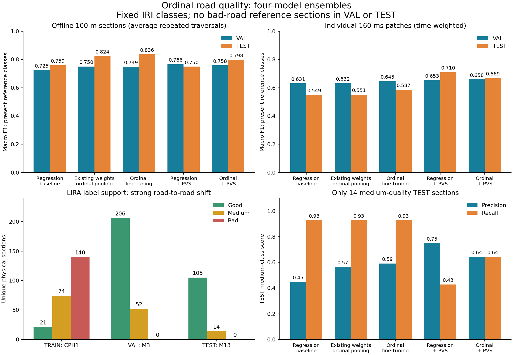
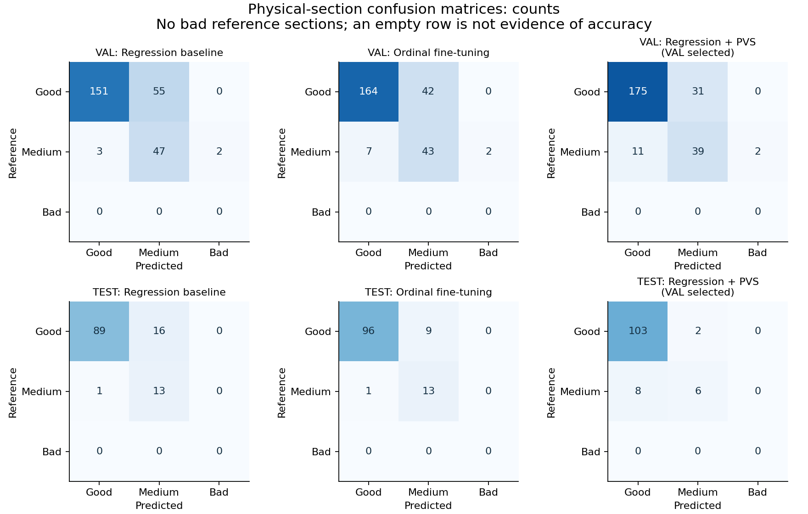

# Ordinal roughness experiment — 19 September 2026

Ordinal prediction is implemented and evaluated alongside the existing regression model, using acceleration XYZ + speed, instance normalization plus statistics, and mounting/noise augmentation. The evidence is mixed: ordinal probability pooling helps offline section classification, while added PVS supervision helps individual patches but can miss medium-quality sections. This experiment does not establish reliable detection of bad roads: neither LiRA VAL nor TEST contains a bad reference section under the declared thresholds.

The deployed regression ensemble and Kalman settings remain the production defaults. The new ordinal model is an experimental window model; its latent numeric score is not a calibrated IRI and cannot be passed to the existing IRI timeline wrapper as one.

The four trained **ordinal + PVS** checkpoints (seeds 52–55) are now packaged in
[`models/ordinal_pvs/`](../models/ordinal_pvs/README.md), with hashes, a portable
loader, augmentation details, and recorded LiRA/Kaggle and preliminary MIT/UMass
external metrics. MIT/UMass adds bad-road examples, subject to its sensor and
profile-alignment limitations; the LiRA results below remain unchanged.

## Results

These are four-member ensembles, seeds 52–55. Each fine-tuned checkpoint was selected on VAL before this study's TEST evaluation. The primary metric averages patch predictions within each traversal, then equally across traversals of a physical 100-m section, giving each physical section one vote. It is offline repeated-traversal performance, not a claim of equivalent single-pass or live patch accuracy.

| Quality method | VAL section macro F1 | TEST section macro F1 | VAL patch macro F1 | TEST patch macro F1 |
| --- | ---: | ---: | ---: | ---: |
| Existing regression, then fixed bins | 0.7246 | 0.7587 | 0.6305 | 0.5493 |
| Existing weights, ordinal probability pooling only | 0.7497 | 0.8240 | 0.6317 | 0.5509 |
| Ordinal fine-tuning | 0.7489 | 0.8364 | 0.6455 | 0.5866 |
| Regression fine-tuning + PVS | **0.7661** | 0.7496 | 0.6530 | **0.7100** |
| Ordinal fine-tuning + PVS | 0.7581 | 0.7976 | **0.6585** | 0.6693 |

Macro F1 here averages the two reference classes present in evaluation: good and medium. Predictions of bad still count as errors. The fixed-three-class macro scores are also available in the [metrics receipt](research/ordinal_20260919/summary.json); assigning zero to an absent class in that statistic does not measure its performance. The regression fine-tuning arm without PVS selected epoch zero for all four members and exactly reproduces the existing regression row.

The declared section-F1 selection criterion chose **regression + PVS**, which failed to improve TEST section F1. Choosing the ordinal-only model because its TEST number is higher would be test-based selection. It is a useful ablation result, not grounds to replace the deployed model.

Most of the apparent ordinal gain comes from pooling class probabilities instead of averaging continuous IRI and then applying thresholds. Ordinal training adds only 0.0124 TEST section F1 over the unchanged-weight pooling control: one additional good section becomes correct. Its four selected epochs were `[5, 0, 0, 0]`, so only one member actually changed. That also explains why the training gain must not be described as a large, consistent improvement across seeds.



## What is good, medium, or bad?

LiRA provides independently measured IRI. We declared these boundaries before training, using the exact conversion 1 m/km = 63.36 in/mi:

| Class | Measured IRI, m/km | Cumulative training target |
| --- | --- | --- |
| Good, index 0 | Below 95/63.36, approximately 1.49937 | `[0, 0]` |
| Medium, index 1 | 95/63.36 through 170/63.36 inclusive, approximately 1.49937–2.68308 | `[1, 0]` |
| Bad, index 2 | Above 170/63.36, approximately 2.68308 | `[1, 1]` |

These are FHWA-inspired **IRI-only research classes**, based on the 95/170 in/mi boundaries in the [FHWA calculation procedure](https://www.fhwa.dot.gov/tpm/guidance/hif18022.pdf). They do not reproduce the complete official pavement-condition rating, which also considers other distress and reporting rules. They describe roughness, not pothole presence, surface material, or general driving safety. Earlier project display bins at 2/4/6 m/km use a different definition and cannot be compared directly with these F1 scores.

| LiRA split / road | Good sections | Medium sections | Bad sections |
| --- | ---: | ---: | ---: |
| TRAIN / CPH1 | 21 | 74 | 140 |
| VAL / M3 | 206 | 52 | **0** |
| TEST / M13 | 105 | 14 | **0** |

This is a strong distribution shift between roads. TRAIN has many rough sections, while held-out roads are mostly good. Thresholds were not adjusted to create balanced classes. We need independently labeled held-out bad roads before making any three-class reliability claim. Splitting overlapping windows from CPH1 into validation would disguise this problem by leaking road identity.

## Model and losses

[`OrdinalRoadModel`](../road_training/ordinal.py) keeps the existing shared PatchTST encoder and statistics branch. It accepts `[B,1024,4]`, corresponding to 10.24 seconds at 100 Hz, and produces 64 predictions from 16-sample patches. The disturbance head remains a binary localized-disturbance detector. Its labels do not become quality classes.

The original positive roughness head supplies a latent score `s`. Two ordered cumulative logits are `(log(s) - log(cutpoints)) / temperature`, with a positive learned temperature. The fixed physical boundaries are used for LiRA. The two questions are whether quality is worse than good, and worse than medium. We average their binary cross-entropies over known patches, using the same inverse physical-section observation weights as the regression control.

If their sigmoid outputs are `q0 >= q1`, the three probabilities are `[1-q0, q0-q1, q1]`. These are nonnegative and sum to one. The predicted ordinal class is the median of this distribution. The construction is inspired by rank-consistent ordinal methods such as [CORAL](https://arxiv.org/abs/1901.07884); it is not an exact reproduction of that paper's architecture or benchmark.

Outputs are `quality_logits [B,64,2]`, `quality_probability [B,64,3]`, `quality_class [B,64]`, `patch_valid [B,64]`, and `disturbance_logit [B,64]`. A `quality_score` is exposed for audits. Only regression mode exposes `roughness`: ordinal-only training does not preserve numeric IRI calibration.

LiRA quality patches require complete known label support from one reference section. Section-boundary and missing-label patches are excluded. Quality supervision never manufactures disturbance labels, and Kaggle/RoadSens disturbance labels never manufacture quality targets.

## Added data: PVS

The [PVS authors' dataset](https://github.com/jefmenegazzo/Intelligent-Vehicle-Perception-Based-on-Inertial-Sensing-and-Artificial-Intelligence) supplies nine recordings across three vehicles and three repeated scenarios. We imported the left dashboard acceleration and native GPS speed: 1,080,905 samples, or 3.00 hours. Gyroscope and other simultaneous sensor placements are not used.

The published good/regular/bad labels are **weak supervision**. The [authors' labeling notebook](https://github.com/jefmenegazzo/MPU-9250-and-GPS-Raw-Data-Pre-Processing/blob/master/src/3%20-%20Data%20Class%20Labeling.ipynb) constructs a centered five-second acceleration-magnitude/speed proxy, clusters it into three groups per vehicle, and orders the clusters. These are not independent roughness measurements and cannot simply be assigned LiRA's IRI cutpoints.

PVS therefore uses separate learned ordered cutpoints and a temperature for each vehicle, on the same latent quality score. All nine sessions are TRAIN-only. No PVS score is presented as physical roughness accuracy, and repeated routes/vehicles are not distributed across training and evaluation. The existing LiRA road splits remain intact.

The importer excludes missing acceleration/speed and speed below 1.4 m/s, limiting the source heuristic's stopped-vehicle-is-good shortcut. It retains 387,112 good, 428,130 regular, and 189,667 bad sample labels, with 75,996 samples excluded, before excluding mixed-class patches. GPS speed is held forward for at most 2.5 seconds, without future interpolation. The source IMU was already interpolated by its authors, so its original observation provenance cannot be recovered.

Approximate input alignment is `[source Y, -source X, source Z]`: source +Y correlates with GPS acceleration in all nine TRAIN sessions (r approximately .43–.69), while Z is approximately up. This is mounting alignment, not precision attitude estimation. Standard mounting augmentation is retained. Converted data remain local and are not redistributed.

The other candidates were not given invented roughness labels: Carlos supplies event/depth labels; STRIDE lacks dense calibrated roughness and needs a RoadSens overlap audit; Asphalt/González provide coarse condition categories with incomplete grouping metadata; Data_Car describes material/age. These can support later task-specific experiments, but their labels do not directly establish the same three IRI classes.

## Controlled training and selection

We completed 24 runs: eight initial joint fine-tuning runs (four arms × seeds 52/53), followed by sixteen frozen-backbone runs (four arms × seeds 52–55). Every arm starts from the same existing trained checkpoint for its seed; this tests fine-tuning, not training from scratch.

Each run uses eight epochs × 96 updates, with 128 existing-data windows per update: 32 Kaggle, 64 LiRA, 32 RoadSens. PVS arms add 32 auxiliary windows without removing existing data. Sampling uses eligible stride-one windows with replacement. Thus an epoch is a fixed update budget, not a full pass through every overlapping window. The paired arms see identical existing-data samples and augmentation draws. PVS has a separate RNG so its dropout does not perturb the next real-data draw. Extra PVS computation is not hidden as an equal wall-time comparison.

AdamW uses head LR 1e-4, encoder/statistics LR 5e-6 in joint runs, weight decay .01, gradient clipping at 1, CUDA BF16, and FP32 normalization/losses. Quality loss weight is .25; weak PVS loss weight is .10. The detector retains per-dataset balanced focal loss with gamma 2. Augmentation uses yaw ±20°, tilt ±10° with probability .75, plus the existing held-sample noise/bias; speed is preserved. MixUp is not added in this comparison.

Joint fine-tuning often degraded the detector or failed to improve quality enough to beat epoch zero. The follow-up freezes the encoder, statistics embedding, and disturbance head and keeps them in evaluation mode, training only the quality/annotation parameters. No synthetic records are used in these runs.

Checkpoint selection maximizes VAL physical-section macro F1, then minimizes class MAE, with the detector required to remain within .02 F1 of its original member. Epoch zero is eligible. All selected checkpoint hashes are frozen before that study's TEST inference. The ensemble method is also ranked on VAL before its TEST evaluation. The existing project TEST has historical exposure, and the second study follows an already-evaluated first study; this is not a fresh blind benchmark.

## Errors, detector retention, and uncertainty

| Method | TEST good-class F1 | TEST medium-class precision | TEST medium-class recall | TEST medium-class F1 |
| --- | ---: | ---: | ---: | ---: |
| Regression baseline | .9128 | .4483 | .9286 | .6047 |
| Existing weights + ordinal pooling | .9453 | .5652 | .9286 | .7027 |
| Ordinal fine-tuning | .9505 | .5909 | .9286 | .7222 |
| Regression + PVS, selected on VAL | .9537 | .7500 | .4286 | .5455 |
| Ordinal + PVS | .9524 | .6429 | .6429 | .6429 |

All bad-class recall values are unavailable. PVS shifts the selected regression ensemble toward good predictions: it correctly labels 103/105 good TEST sections, but only 6/14 medium ones. The baseline gets 89/105 good and 13/14 medium. Ordinal-only gets 96/105 good and 13/14 medium. Higher overall accuracy alone would hide the PVS medium-class recall loss.



Patch scores tell a different, useful story: regression + PVS improves TEST patch macro F1 from .5493 to .7100. Those samples are correlated and weighted by time spent in each section; they are not 119 independent section decisions. The real-time task needs separate single-traversal, distance-weighted and rolling-inference evaluation before promoting this result to the app. This experiment evaluates fixed non-overlapping windows and excludes incomplete tails/unknown targets.

All frozen-backbone variants have identical Kaggle patch detector metrics:

| Split | Precision | Recall | F1 |
| --- | ---: | ---: | ---: |
| VAL | .6061 | .8552 | .7094 |
| TEST | .5495 | .9528 | .6970 |

These use a fixed .5 patch threshold, without Kalman smoothing. They are not event F1 or the earlier filtered-alert precision/recall. Every selected frozen encoder/statistics/detector tensor was checked bit-for-bit against its source; every epoch's VAL detector metrics and every ensemble's VAL/TEST detector metrics match.

A paired 2,000-replicate bootstrap resampled 24 spatial blocks of 500 m in TEST. The ordinal-training improvement over unchanged-weight ordinal pooling is +.0124 F1, with a percentile interval [0, .0368]. PVS versus regression is −.0092, interval [−.2387, .1358]. These intervals are conditional on this road and these checkpoints; they do not account for selection across many experiments or establish unseen-road/vehicle generalization. Only 14 medium sections and no bad sections are available.

## Run and inspect

From the repository root, with an existing aligned real corpus and downloaded PVS sensor/label CSVs:

```bash
python -m road_training.tools.prepare_pvs \
  --raw artifacts/pvs_raw --output artifacts/pvs_ordinal

python -m road_training.experiments.ordinal_study --init \
  --out reports/new_ordinal_study \
  --data artifacts/data_roadsens_aligned --pvs artifacts/pvs_ordinal \
  --seeds 52 53 54 55 --freeze-backbone

python -m road_training.experiments.ordinal_study --run \
  --out reports/new_ordinal_study

python -m road_training.experiments.ordinal_report \
  --study reports/new_ordinal_study
```

PVS raw folders should be `PVS 1` through `PVS 9`, containing `dataset_mpu_left.csv`, `dataset_gps.csv`, and `dataset_labels.csv`. Download from the [authors' Kaggle release](https://www.kaggle.com/datasets/jefmenegazzo/pvs-passive-vehicular-sensors-datasets). The importer also handles Kaggle ZIP responses stored under those CSV filenames. It refuses to overwrite an output corpus.

The study requires a CUDA GPU with BF16 support. A fresh output directory is required for each declared plan. Plans hash source files, manifests, and starting weights; completed runs are skipped only after checksum verification. An interrupted incomplete arm restarts from its initial checkpoint, not from the interrupted optimizer state. Ensemble evaluation writes its VAL selection receipt before TEST comparison and refuses to overwrite an existing evaluation directory.

Load a selected experimental checkpoint for window inference:

```python
import torch
from road_training.instance_model import InstancePatchTST
from road_training.ordinal import OrdinalRoadModel

saved = torch.load('reports/new_ordinal_study/ordinal_seed52/best.pt',
                   map_location='cpu', weights_only=False)  # Your own trusted checkpoint.
model = OrdinalRoadModel(InstancePatchTST(**saved['config']['encoder_config']),
                         **saved['config']['model_config'])
model.load_state_dict(saved['model_state'])
model = model.cuda().eval()
with torch.inference_mode(), torch.autocast('cuda', dtype=torch.bfloat16):
    output = model(x.cuda(), mask.cuda())  # x: raw SI [B,1024,4].
classes = output['quality_class']         # 0 good, 1 medium, 2 bad.
known = output['patch_valid']
```

The full Python suite passes **211 tests**. New coverage includes unit boundaries, ordered probabilities, missing-label/weighted gradients, unchanged initial predictions, separate PVS annotation gradients, spatial aggregation, future-free GPS holding, source axis rotation, class-column order, window/patch boundaries, probability ensemble semantics, and paired-block alignment. Real-data CUDA BF16 smoke steps covered both losses and all four sources. The prepared-file audit verified 928 TRAIN/VAL/PVS files. A later importer hardening made CSV label-column ordering explicit; all nine actual CSVs already used the correct order, so it does not change the recorded experiments.

Local complete histories, checkpoints, source snapshots, split audit and figures are under `reports/ordinal_roughness_20260919` and `reports/ordinal_roughness_frozen_20260919` in the parent research workspace. The compact metrics/checksum receipt is versioned beside the figures. Archived sources preserve the exact code used before subsequent harmless importer hardening.
